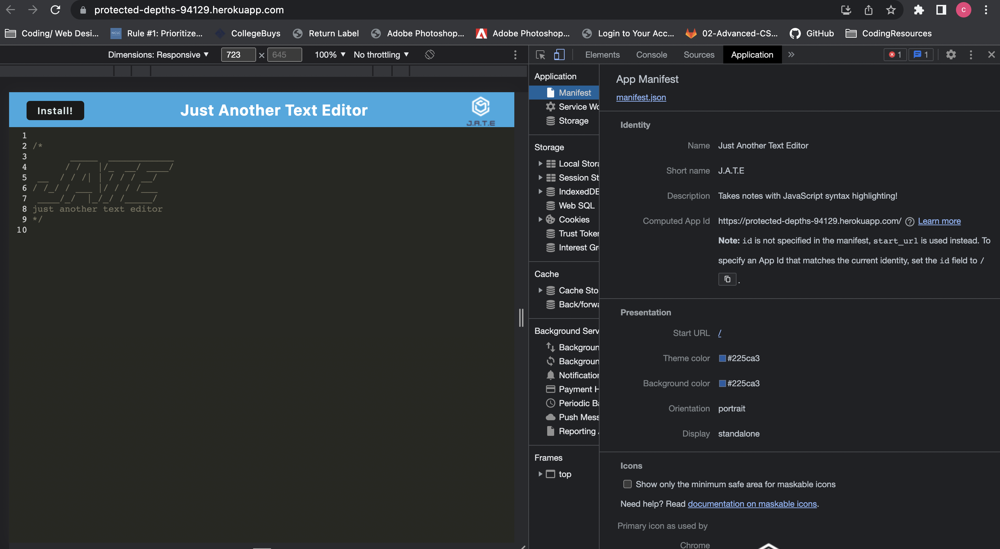
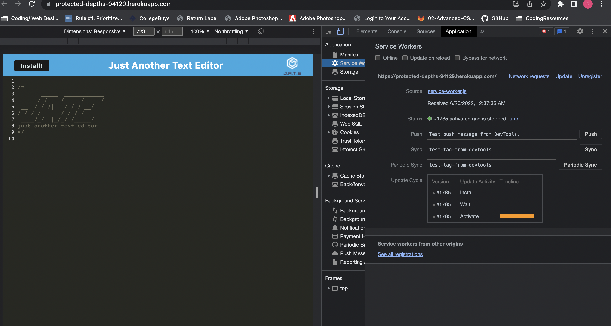
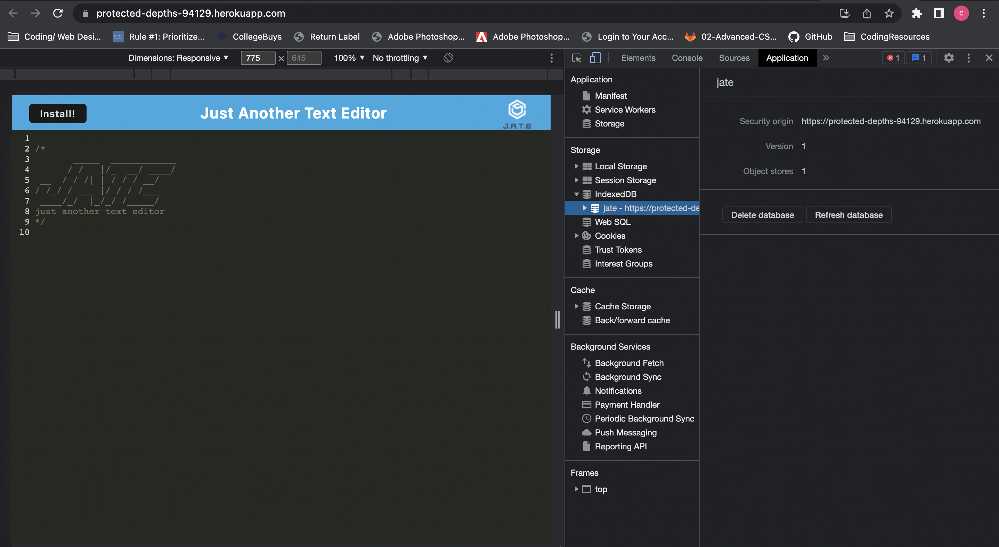
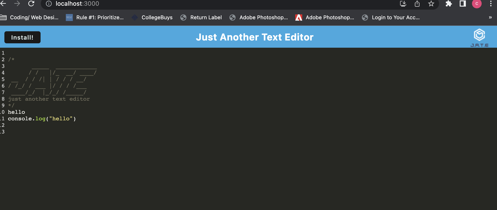

# handy-text-editor

## Description

A text-editor, single-page web application that helps users to create and save notes or code snippets. Users can type in their notes and click off od the window to save their content in the database using data persistence. The content will be displayed again after reloading the web application. This web application can function offline with the option to install onto your device.

## Table of Contents

- [Description](#description)
- [Installation](#installation)
- [Usage](#usage)
- [Technologies](#technologies)
- [Credits](#credits)
- [Assets](#assets)

## Installation

No installation needed, please visit the deployed [link](https://protected-depths-94129.herokuapp.com/) directly

- Click `Install` button to download the application in your local machine in order to use it offline

-Developers -

- Navigate to root folder: install npm packages: `npm i`
- Start the app: `npm start` or `npm run dev`
  - The `dist` folder will be auto-generated with html page

## Usage

Please follow the usage instruction here:

- Open application from the Heroku deployed [link](https://protected-depths-94129.herokuapp.com/)
- Type in your notes
- Click off of the DOM window to save your notes
- Your notes will be displayed everytime you visit the page
  -Install for offline functionality

## Technologies

```md
JavaScript
HTML
CSS
Express.js
IndexedDB
Webpack
```

## Credits

The starter code is provided by The Coding Boot Camp | UC San Diego Extension | Trilogy Education Services, LLC

## Assets

TThe following are screenshots from the application:

Manifest JSON



Service Workers



IndexedDB



Text editor offline


